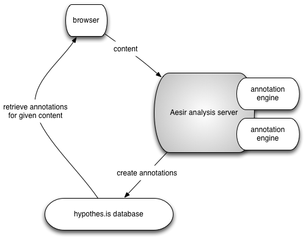

Annotation as a service: helping build a global knowledge layer with annotation of the dark literature.
=======================================================================================================

US Team Lead: C. Titus Brown, UC Davis.

non-US Team Lead: Christof Dorner, Hypothes.is.

Introduction:
-------------

`Hypothes.is <http://hypothes.is>`__ is an annotation overlay that
allows annotations to be associated with Web text. Each annotation
consists of a document ID, a document anchor, some free text, and
tags; annotations can be either public or belong to private groups.
The hypothes.is service currently offers an overlay display where
these annotations are placed on HTML or PDF views of documents;
annotations can also be shared and searched globally. Annotations can
be placed manually by means of a browser plugin, or the same code
delivered via JavaScript embedding or a Web proxy.  Annotations are
stored in the hypothes.is central database and can be retrieved on
demand for any specified URL, user, group, or tag. Annotations are
searchable along these facets as well as with free text query. Annotations
will soon be link-able to ORCIDs, as well, tying into a global system of
authorship identifiers.

Hypothes.is offers an optional overlay and enables permissionless
annotation by 3rd parties unaffiliated with either the content
consumer or the content provider.  Crucially, this bypasses much of
the friction associated with working with publishers to provide an
annotation overlay, although a consortium of publishers *is*
working closely with hypothes.is.

For more on hypothes.is, please see `Introducing Hypothes.is <https://2016-aesir.readthedocs.org/en/latest/introducing-hypothesis.html>`__.

The problems and the proposed solution
--------------------------------------

While deceptively simple in concept, the potential of Hypothes.is to
provide a dynamic unifying layer across biomedicine is significant.

There are two problems we are interested in solving.

First, large portions of the biomedical scholarly literature are
completely inaccessible to automated, large scale analysis. Moreover,
large portions of the biomedical literature may have been annotated,
either by humans or automated algorithms, but these annotations are
not easily shared, nor are they available for global analysis. Rather,
each is locked in an individual silo.

Second, the hypothes.is annotation system currently relies on manual
annotation.

We believe we can help solve these two bigger problems with one
technical approach: we will give individuals an in-browser app letting
them submit any paper to an analysis server that will openly annotate
the paper.  We will also build server-side
software to support *any* annotation engine.

This will permit individuals to link closed papers of interest into
the global annotation web, while also enabling new annotation
*services* to be built quickly and easily.

More generally, this can drive the creation of machine-based
structured tags to enrich texts, which will create a skein of linked
data that could be surfaced in various ways.  And, because annotations
are RDF, the recording and exposure of data linkages becomes available
for querying.  In essence, it would help create derived knowledge that
could be queried in powerful ways.

We have provisionally named this server-side system "Aesir."

A prototype: SciBot
-------------------

Working with partners at the Neuroscience Information Framework (NIF),
Hypothes.is has deployed an alpha service called SciBot. SciBot is a
tool that scans scientific papers for text snippets called `RRIDs
(Research Resource Identifiers
<http://f1000research.com/articles/4-134/v1>`__), annotates them with
metadata stored elsewhere, and enables human curators to validate or
enhance the connection between an RRID that appears in the text of a
paper and its associated metadata.  RRID are unique identifiers for
certain types of resources used in biomedicine, e.g. antibodies, model
organisms and software tools/databases. These identifiers are issued
by authoritative community repositories like the `Antibody Registry
<http://antibodyregistryo.org>`__, and aggregated by NIF through its
data aggregation platform, SciCrunch. When the SciBot plug in is
activated, it highlights RRID's in the text and pulls the metadata
about the particular resource from the SciCrunch resolving service
into the Hypothes.is client, where it is presented as an annotation
overlay on the text. Viewers can reply to the annotation, e.g., to
note an error or supply additional information on a resource. In this
way, Hypothes.is creates a hybrid machine-human interface that has
general purpose utility.  Aesir would extend this to arbitrary
annotation engines.

Please see the associated video for a demo. The source code is
publicly available under an open source license at
https://github.com/judell/rrid.

Three use cases that Aesir would enable
---------------------------------------

1. **Annotating closed biomedical literature with links to genome
   databases.** Rebecca is reading a C. elegans paper in a
   closed-access journal, and would like to decorate it with
   annotations connecting genes and genome coordinates to Wormbase,
   the C. elegans genome database.  She installs the Wormbase
   "annotate this" bookmark and clicks on it; this sends the paper
   to an Aesir server that annotates it and posts the annotations to
   hypothes.is, where they can be viewed by Rebecca and others.

   This is a general pattern: many databases may want to layer annotations
   on the literature, but working with many publishers directly can be
   an insurmountable challenge.  Hypothes.is solves this problem, but
   as of yet there is no good way for databases to engage with Hypothes.is
   in high-throughput.

2. **Extract data from closed literature.** Jason would like to use
   ContentMine to extract data from a closed-access paper he is
   reading, for his own reuse.  He clicks the ContentMine "extract
   this" bookmark, which sends the paper to an Aesir server which runs
   the ContentMine annotation engine on it and redirects Jason to the
   resulting data.  In line with ContentMine's collaboration with
   hypothes.is, links to the data are also provided directly on the paper.

   By building a system that lets users submit interesting literature
   to the annotation system, we believe we can crack open the closed
   literature to an significant extent.  We also expect a higher density of
   annotations around more "active" or still-relevant papers, which will
   provide interesting opportunities for meta-analysis.

3. **Leveraging & driving open peer review.** Tina is reviewing a
   paper, and wants to mark it up with external blog commentary and
   public reviews.  Unfortunately, the paper is a revision of a posted
   preprint and so its hypothes.is URL has changed and no annotations
   are associated with it; James submits the paper to an Aesir-based
   service that identifies it as a duplicate of a previously annotated
   paper and transfers the annotations over to it where possible.  As
   a bonus, James could annotate the paper with his review when he is
   done.
   
   Here, Hypothes.is could help tame the impending chaos of pre- and
   post-publication open peer review, by interlinking comments from
   multiple sources to each paper.  These comments could even be
   summarized and overlaid by a meta-analysis service, providing additional
   value to readers.

In these three use cases, considerable computational work is being done
by the remote server - none of this work can be done within the confines
of the current client-side hypothes.is approach, and all three use cases
could be supported with a single technical solution.

Deliverables
------------

The first line of deliverables would be a full server (implemented in
Python) for adding annotations to documents, together with JavaScript
bookmarklets to enable submission of documents to such servers from
within any modern Web browser.  The server code would contain an open
source implementation of the parsing and annotation-marking logic used
in hypothes.is, providing a framework that would readily enable
developers to consume text and annotate it according to their own
logic.  We would provide a full demo server implementation using a
public open source code base (here, working with ContentMine would be
a natural fit). We would also provide simple hooks to enable anyone
to integrate whatever annotation engine they wanted.

On top of these deliverables we envision a variety of services, depending
on where we see opportunities emerge:

* large-scale annotation search and comparison, so that documents can
  be grouped and analyzed based on their annotations and larger
  networks of annotations;
   
* enabling human feedback on and editing of automated annotations
  within hypothes.is itself, so that viewers can annotate annotations
  and identify misannotations;
  
* a recommendation system based on annotation similarity and
  interlinking, so that when annotations become dense enough, new
  associates can be found between existing literature;
  
* a notification service that would allow people to "watch"
  collections of annotations and/or publications, and filter the
  notifications;
  
* more advanced annotation overlays for documents;
  
* tools for managing annotations from multiple sources, integrating
  with social information (lab groups, collaborators, institutions),
  and support for trust network overlays;

* unifying scattered versions and representations by marrying
  automatic analysis and human curation; for example, hypothes.is
  could be used to store "document signatures" that could be searched
  to connect papers with different URIs.

Impacts and ecosystem
---------------------

First and foremost, we believe we can enable an ecosystem of annotation
algorithms, some general (e.g. linguistic analysis of document
structure) and some field-specific (e.g. automated extraction and
annotation of drug-drug interactions across document collections).

Second, we envision this as providing entree to the "dark
literature" via annotations.  Annotations are exempt from publisher's
usage restrictions, which means that anyone with access to a document
can submit it to an annotation server, layer annotations upon the
document, and publicize these annotations.

Third, by integrating human feedback and meta-annotation of these
primary annotations, we can help provide algorithm authors with
"eyeballs" and corrections on their annotations.  This kind of
feedback will help drive better annotation algorithms.

Fourth, with tools to compare collections of annotations across large
bodies of papers, we will enable meta-analysis of annotation networks
and be able to build connections between overlapping but disparate
subfields of scientific literature.

Fifth, we can provide tools for databases, publishers and libraries to
work with closely held document collections. For example, someone with
access to large bodies of papers could annotate with the results of
data mining applied to the paper; or, users with institutional access
to closed-access publications could submit those publications to a
ContentMine server for open annotation; or, biological databases could
use their special knowledge of identifiers to provide annotations
based on a compute-intensive analysis; or, publishers and institutions
could provide a "first look" of annotation for their own document
collections; or, reviewers could privately annotate papers they are
reviewing with an automated system to identify relevant literature.

Why does this fit the Open Science Prize?
-----------------------------------------

We are encouraging and supporting services, tools, and platforms that
enable the generation of open content: here, the comments,
extractions, and annotations on literature.  The proposed system could
also consume, integrate, analyze, and compare *existing* annotations,
enabling **metanalysis** of annotations.  And, since annotations in
hypothes.is are under CC0, there is no restriction on reuse or
remixing.

Moreover, the use of closed access literature to produce annotations
is arguably legal because it is non-infringing transformative fair use
(although this has not been tested yet; see `link
<http://www.baercrossey.com/1723/google-books-case-transforms-the-fair-use-standard>`__
for argument).  By making use of remote "cloud" services to analyze
(but not retain) literature and doing so at a user's request, we
believe we avoiding any infringement of license terms.  We do expect
that the initial beneficiaries of this will be the closed-access
publishers who may find more users of their closed archives, but even
this serves the greater good by linking this closed literature into
the global annotatome.  In the long term, we believe this will serve
as a powerful demonstration of the uses and power of open literature.

Longer term, we believe there will be many groups interested in
permissionless server-side automated annotation of text, and we hope
that by providing an automated system matching the existing client
annotation interface, we can more readily enable the development of an
ecosystem of approaches to open annotation.  Essentially, we hope to
expand the range of creative people who can try out new annotation
approaches.

Additional use cases
--------------------

Duplication, version, and plagiarism analysis could be performed
automatically. It would be straightforward to identify cases where
highly similar annotations were placed on different document IDs;
the documents could then be examined for document equivalence, different
versions, or plagiarized text.

Annotations could enable back citation from future literature,
including identification of retracted citations, comments, and blog
posts on the work and derived works.

Hypothes.is could be used to place forward links to software,
computational workflows, & replications of published work on papers
automatically.

What would we spend the money on?
---------------------------------

The prize money would be spent on developing an open source server and
proof of concept, and applying it to our three primary use cases.  All
software products would be under the BSD 3-clause license.
Hypothes.is itself is `completely open source
<https://github.com/betatim/openscienceprize/pull/85#issuecomment-190232950>`__.

We plan to support an existing Hypothes.is developer to implement the
prototype, and will then run hackathons once we have an initial proof
of concept.

Architecture
------------

Our primary client-side mechanism will be a bookmarklet or in-browser
app that would submit HTML or PDF text to a server for analysis.  On
the server side, we would provide Python libraries for text
consumption and normalization, anchor extraction, annotation
retrieval, and annotation submission.  Our ultimate goal is to open up
an ecosystem of annotation production, consumption, and meta-analysis
to everyone, and to allow anyone with access to any document to enter
it into this ecosystem.

   Figure 1: The basic architecture we propose; the annotation engines
   would make use of but be largely independent of the Aesir code.
